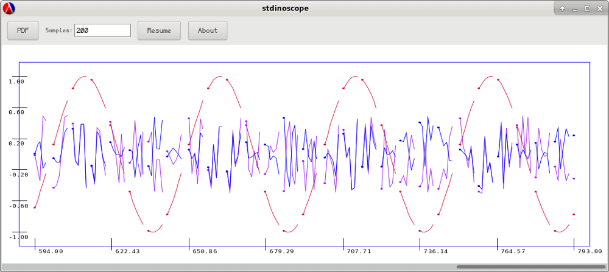

# stdinoscope
Live Charting of Numeric Tuples from STDIN



## Options
```
stdinoscope [ <option> ... ]
where <option> is one of:

  -C <datum-colors>    comma-separated list of colors, one for each sample
                       (color name or RGB hex, in order of specification)

  --color-names        list named colors, then exit
                       (your terminal needs true-color escape codes for this to work)

  -I <input-device>    STDIN if set to '-' or left unspecified

  -S <sample-count>    number of samples to display in the window

  --xdiv <x-div>       number of x-divisions
  --ydiv <y-div>       number of y-divisions

  --font <font-face>   axes font

  -L, --log-scale      use logarithmic y-scale (not yet implemented)

  --help, -h           Show this help
```

## How to use it

Pipe newline-separated tuples into Stdinoscope.  Values within the tuple are to be space-separated.  Stdinoscope defaults to showing up to 3-tuples.  To chart larger tuples, provide a sufficient number of colors (one for each value in the tuple) using the `-C` flag.

So if we have a program `output` that produces a sequence of 4-tuples, like this:

```
1.0 1.0 2.0 2.0
3.3 4.7 8.8 1
7.8 7.1 7   10
...
```

Stdinoscope can live chart its output with the following command:

```
./output | ./stdinoscope -C red,green,blue,yellow
```

The **Pause** button suspends reading from STDIN, and allows you to scroll through previously captured samples.

The **PDF** button creates a PDF of the current window contents.

## Caveats

- If there is a delay between when the output is produced, and when Stdinoscope finally draws it, look out for the STDIN output buffering options in your output program.  Buffered outputs will only flush in large chunks--rather than sending the information as soon as it is produced.

- Gaps in the tuple sequence, or non-numeric input for values within a tuple, are rendered as gaps in the charts.

- This has been tested and developed primarily in Linux--with only minor and intermittent trials under Windows.

- If you like to chart different things under Unix/Linux, you can save a lot of time by just making a FIFO, and piping it to Stdinoscope.

### FIFO Example:

In terminal 1:
```
mkfifo myinput
cat ./myinput | stdinoscope
```

In terminal 2:
```
./output-program > ./myinput
...
```

## Pre-emptive Strike

- A few of the inner-loop operations were written as mutations of `let` variables rather than proper recursion.  Per the Racket guide, that *should* lead to inferior performance.  In testing, that was not the case.  The recursive versions had higher CPU time, and even small amount of GC time.  The mutative versions had lower CPU time, and no GC time, so they won.
